# 🌾 Farmer AI - Agent Architecture Flow Diagram

```mermaid
graph TB
    %% User Interaction Layer
    UI[🌐 User Interface]
    UI --> |"Text, Voice, Images"| INPUT[📝 Multimodal Input Processing]
    
    %% Input Processing
    INPUT --> |"Text Queries"| TEXT[💬 Text Processing]
    INPUT --> |"Voice/Audio"| VOICE[🎤 Voice Processing]
    INPUT --> |"Plant Images"| IMAGE[📸 Image Processing]
    INPUT --> |"Mixed Input"| MULTI[🔄 Multimodal Processing]
    
    %% Core Agent
    subgraph CORE_AGENT [🤖 Unified Farmer AI Agent]
        AGENT[🌾 unified_farmer_agent<br/>Model: gemini-2.0-flash-exp]
        AGENT --> |"Complex Disease Cases"| SUB_AGENT[🔬 Disease Explanation Specialist]
    end
    
    TEXT --> AGENT
    VOICE --> AGENT
    IMAGE --> AGENT
    MULTI --> AGENT
    
    %% Tool Categories
    subgraph AI_TOOLS [🧠 AI-Powered Tools]
        AI_CROP[🌱 AI Crop Planner<br/>ML Model: RandomForest-2.pkl]
        HEALTH_ANALYZER[🔍 Crop Health Analyzer<br/>CNN Model: plant_disease_prediction_model.h5]
    end
    
    subgraph TRADITIONAL_TOOLS [📚 Knowledge-Based Tools]
        GOV_SCHEMES[🏛️ Government Schemes Tool]
        NPK_MGMT[⚗️ NPK Management Tool]
        PLANT_HEALTH[🌿 Plant Health Diagnostic Tool]
        CROP_PLANNING[📋 Crop Planning Tool]
    end
    
    subgraph DATABASE_TOOLS [🗄️ Firestore Database Tools]
        CREATE_CAMPAIGN[📝 Create Campaign Tool]
        FETCH_DOCS[📄 Fetch Documents Tool]
        UPDATE_CAMPAIGN[✏️ Update Campaign Tool]
        CREATE_BID[💰 Create Bid Tool]
    end
    
    %% Tool Connections
    AGENT --> AI_CROP
    AGENT --> HEALTH_ANALYZER
    AGENT --> GOV_SCHEMES
    AGENT --> NPK_MGMT
    AGENT --> PLANT_HEALTH
    AGENT --> CROP_PLANNING
    AGENT --> CREATE_CAMPAIGN
    AGENT --> FETCH_DOCS
    AGENT --> UPDATE_CAMPAIGN
    AGENT --> CREATE_BID
    
    %% External Data Sources
    subgraph EXTERNAL_DATA [🔗 External Data Sources]
        FIRESTORE[(🔥 Firestore Database<br/>Campaigns, Bids, Documents)]
        ML_MODELS[(🤖 ML Models<br/>Disease Detection, Crop Planning)]
        KNOWLEDGE_BASE[(📖 Knowledge Base<br/>Government Schemes, NPK Data)]
    end
    
    %% Data Flow
    AI_CROP --> ML_MODELS
    HEALTH_ANALYZER --> ML_MODELS
    CREATE_CAMPAIGN --> FIRESTORE
    FETCH_DOCS --> FIRESTORE
    UPDATE_CAMPAIGN --> FIRESTORE
    CREATE_BID --> FIRESTORE
    GOV_SCHEMES --> KNOWLEDGE_BASE
    NPK_MGMT --> KNOWLEDGE_BASE
    
    %% Response Processing
    subgraph RESPONSE_LAYER [📤 Response Generation]
        TEXT_RESP[💬 Text Response]
        VOICE_RESP[🔊 Voice Response]
        MULTI_RESP[🎭 Multimodal Response]
    end
    
    AGENT --> TEXT_RESP
    AGENT --> VOICE_RESP
    AGENT --> MULTI_RESP
    SUB_AGENT --> TEXT_RESP
    
    %% Output to User
    TEXT_RESP --> OUTPUT[📱 Formatted Output]
    VOICE_RESP --> OUTPUT
    MULTI_RESP --> OUTPUT
    OUTPUT --> UI
    
    %% Deployment Options
    subgraph DEPLOYMENT [🚀 Deployment Options]
        VERTEX_AI[☁️ Vertex AI Agent Engine<br/>Default ADK Web UI]
        CUSTOM_WEB[🌐 Custom FastAPI Web App<br/>web_app/main.py]
        CLOUD_RUN[🏃 Google Cloud Run]
    end
    
    CORE_AGENT -.-> VERTEX_AI
    CORE_AGENT -.-> CUSTOM_WEB
    CORE_AGENT -.-> CLOUD_RUN
    
    %% Styling
    classDef userInterface fill:#e1f5fe,stroke:#01579b,stroke-width:2px
    classDef coreAgent fill:#f3e5f5,stroke:#4a148c,stroke-width:3px
    classDef aiTools fill:#e8f5e8,stroke:#1b5e20,stroke-width:2px
    classDef traditionalTools fill:#fff3e0,stroke:#e65100,stroke-width:2px
    classDef databaseTools fill:#fce4ec,stroke:#880e4f,stroke-width:2px
    classDef externalData fill:#f1f8e9,stroke:#33691e,stroke-width:2px
    classDef deployment fill:#e3f2fd,stroke:#0d47a1,stroke-width:2px
    
    class UI,INPUT,OUTPUT userInterface
    class CORE_AGENT,AGENT,SUB_AGENT coreAgent
    class AI_TOOLS,AI_CROP,HEALTH_ANALYZER aiTools
    class TRADITIONAL_TOOLS,GOV_SCHEMES,NPK_MGMT,PLANT_HEALTH,CROP_PLANNING traditionalTools
    class DATABASE_TOOLS,CREATE_CAMPAIGN,FETCH_DOCS,UPDATE_CAMPAIGN,CREATE_BID databaseTools
    class EXTERNAL_DATA,FIRESTORE,ML_MODELS,KNOWLEDGE_BASE externalData
    class DEPLOYMENT,VERTEX_AI,CUSTOM_WEB,CLOUD_RUN deployment
```

## 🏗️ Architecture Overview

### 🎯 **Core Components**

#### 1. **Unified Farmer AI Agent** 🤖
- **Model**: `gemini-2.0-flash-exp` (Multimodal LLM)
- **Capabilities**: Text, Voice, Image, and Multimodal processing
- **Primary Role**: Central orchestrator for all farming-related queries
- **Sub-Agent**: Disease Explanation Specialist for complex cases

#### 2. **Tool Ecosystem** 🛠️

**🧠 AI-Powered Tools:**
- **AI Crop Planner**: Uses RandomForest ML model for soil-based recommendations
- **Crop Health Analyzer**: Uses CNN model for plant disease detection from images

**📚 Knowledge-Based Tools:**
- **Government Schemes Tool**: Provides subsidy and loan information
- **NPK Management Tool**: Fertilizer recommendations based on soil analysis
- **Plant Health Diagnostic Tool**: Symptom-based disease diagnosis
- **Crop Planning Tool**: Seasonal and location-based crop suggestions

**🗄️ Database Tools:**
- **Campaign Management**: Create and manage crop selling campaigns
- **Document Management**: Fetch market opportunities and documents
- **Bid Management**: Handle buyer bids and negotiations

#### 3. **Data Sources** 💾
- **Firestore Database**: Campaigns, bids, market documents
- **ML Models**: Pre-trained models for disease detection and crop planning
- **Knowledge Base**: Government schemes, NPK data, farming best practices

### 🔄 **Data Flow**

1. **Input Processing**: 
   - Users interact via text, voice, or images
   - Multimodal input is processed by the unified agent

2. **Tool Selection & Execution**:
   - Agent analyzes query and selects appropriate tools
   - Tools execute with external data sources
   - Results are processed and formatted

3. **Response Generation**:
   - Agent generates contextual responses
   - Supports text, voice, or multimodal output
   - Maintains conversation context across sessions

### 🚀 **Deployment Architecture**

#### **Option 1: Vertex AI Agent Engine** (Recommended)
- ✅ Fully managed deployment
- ✅ Default ADK web UI with professional interface
- ✅ Auto-scaling and built-in monitoring
- ✅ Enterprise-grade security and compliance

#### **Option 2: Custom FastAPI Web Application**
- 🌐 Custom web interface (`web_app/main.py`)
- 🎨 Tailored UI/UX for specific requirements
- 🔧 Full control over frontend experience

#### **Option 3: Google Cloud Run**
- ☁️ Containerized deployment
- 🔄 Auto-scaling based on traffic
- 💰 Pay-per-use pricing model

### 🎯 **Key Features**

#### **Multimodal Capabilities**
- **Text**: Natural language conversations in multiple languages
- **Voice**: Voice queries with conversational responses
- **Images**: Plant/crop image analysis for disease detection
- **Combined**: Mixed input types for comprehensive assistance

#### **Comprehensive Farming Support**
- **Crop Planning**: AI-powered soil analysis and crop recommendations
- **Disease Management**: Image-based disease detection and treatment advice
- **Market Access**: Contract farming and buyer-seller connections
- **Government Support**: Subsidy and loan scheme guidance
- **Soil Management**: NPK analysis and fertilizer recommendations

#### **Scalable Architecture**
- **Modular Design**: Independent tools for different farming domains
- **External Integration**: Firestore for persistent data, ML models for AI capabilities
- **Session Management**: Persistent conversations with context retention
- **Performance Monitoring**: Built-in tracing and analytics

### 🔮 **Technology Stack**

- **LLM**: Google Gemini 2.0 Flash (Multimodal)
- **Framework**: Google Agent Development Kit (ADK)
- **Database**: Google Firestore
- **ML Models**: TensorFlow/Keras (Disease Detection), Scikit-learn (Crop Planning)
- **Deployment**: Vertex AI Agent Engine / Cloud Run
- **Languages**: Python, JavaScript (for web interface)

This architecture provides a comprehensive, scalable, and user-friendly farming assistant that can handle diverse agricultural needs through a unified interface.
